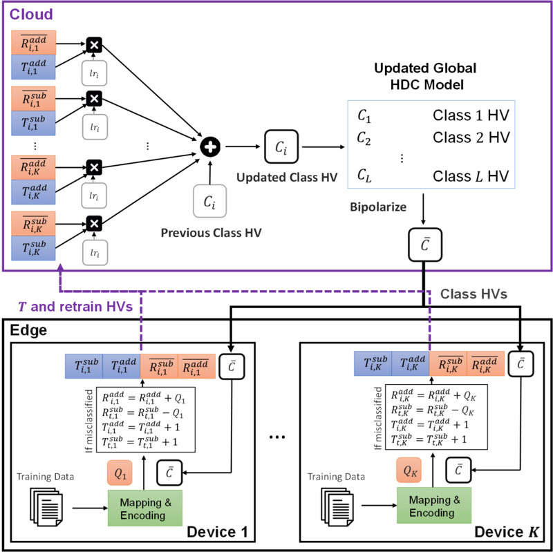

# FL-HDC
This Code is the Official Python Implementation of [FL-HDC: Hyperdimensional Computing Design for the Application of Federated Learning](https://ieeexplore.ieee.org/document/9458526) **(IEEE AICAS2021)**

<p align="center">
  
</p>

## Abstract

Federated learning (FL) is a privacy-preserving learning framework, which collaboratively learns a centralized model across edge devices. Each device trains an independent model with its local dataset and only uploads model parameters to mitigate privacy concerns. However, most FL works focus on deep neural networks (DNNs), whose intensive computation hinders FL from practical realization on resource-limited edge devices. In this paper, we exploit the high energy efficiency properties of hyperdimensional computing (HDC) to propose a federated learning HDC (FL-HDC). In FL-HDC, we bipolarize model parameters to significantly reduce communication costs, which is a primary concern in FL. Moreover, we propose a retraining mechanism with adaptive learning rates to compensate for the accuracy degradation caused by bipolarization. Under the FL scenario, our simulation results show the effectiveness of our proposed FL-HDC across two datasets, MNIST and ISOLET. Compared with the previous work that transmits complete model parameters to the cloud, FL-HDC greatly reduces 23x and 9x communication costs with comparable accuracy in ISOLET and MNIST, respectively.


## Requirements
* python 3.7
* matplotlib
* scikit-learn
* pandas
* numpy

## Prepare Dataset
* Download MNIST

  ```bash
  cd "data preprocess src"
  python3 download_data.py
  python3 sort_data.py
  ```
 * Download ISOLET and UCIHAR
 
    ```bash
    cd ISOLET(UCIHAR)
    cd "data preprocess src"
    python3 download_data.py
    python3 sort_data.py
    ```
## Usage

  Click into the Specific Directories and follow the instructions
  
## Directory Description
Dir | Description |
|-------------------|-------------------|
**[FLHDC:](./FLHDC)** | one-shot Federated HDC |
**[FLHDC_Integer AM](./FLHDC_IntegerAM)** |   Federated HDC with retrained updates and IntegerAM   |
**[FLHDC_binaryAM_new](./FLHDC_binaryAM_new)** | Published Version of FLHDC |
**[Centralized HDC](./Centralized%20HDC)** | One-shot and Retrained HDC trained by centralized dataset. |
**[data preprocess src](./data%20preprocess%20src)** | Download datasets and preprocess them into csv files  |
**[MNIST](./MNIST)** |   Storage for preprocessed data csv   |

## Author
Cheng Yen Hsieh
* National Taiwan University, Electrical Engineering

## Citation
> C. -Y. Hsieh, Y. -C. Chuang and A. -Y. A. Wu, "FL-HDC: Hyperdimensional Computing Design for the Application of Federated Learning," 2021 IEEE 3rd International Conference on Artificial Intelligence Circuits and Systems (AICAS), 2021, pp. 1-5, doi: 10.1109/AICAS51828.2021.9458526.
